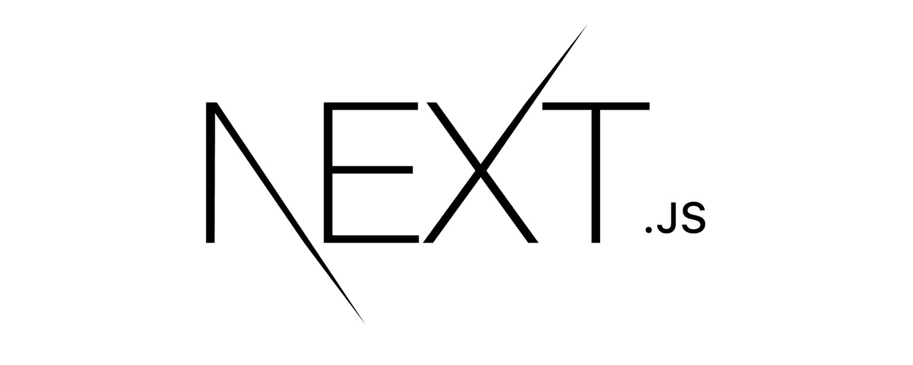

### Hi there 👋
  

I'm Maria, a software engineer who's passionate about coding and always hungry for learning. I thrive on challenges and am dedicated to honing my skills to stay at the forefront of technology. 💻🚀

 
<picture>
 <source media="(prefers-color-scheme: dark)" srcset="./assets/she-codes.gif">
 <source media="(prefers-color-scheme: light)" srcset="./assets/she-codes.gif">
 
 <figcaption>Background GIF by <a href="https://github.com/Anmol-Baranwal">Anmol Baranwal</a>  on <a  href="https://github.com/Anmol-Baranwal/Cool-GIFs-For-GitHub?tab=readme-ov-file">cool GIFs for Github</a>.</figcaption>
</picture>

Feel free to connect with me on

 My Tech Stack: 

 

 

 

- 🔭 I’m currently working at <a href="https://www.krakenflex.com/">Kraken</a>
- 🌱 I’m currently learning Rust
- 📚 Research area: Call losses in Cloud systems serving multidimensional random traffic – The case of the Infrastructure as a Service architecture.
- 😄 Pronouns: She/Her

Visitors

[]
